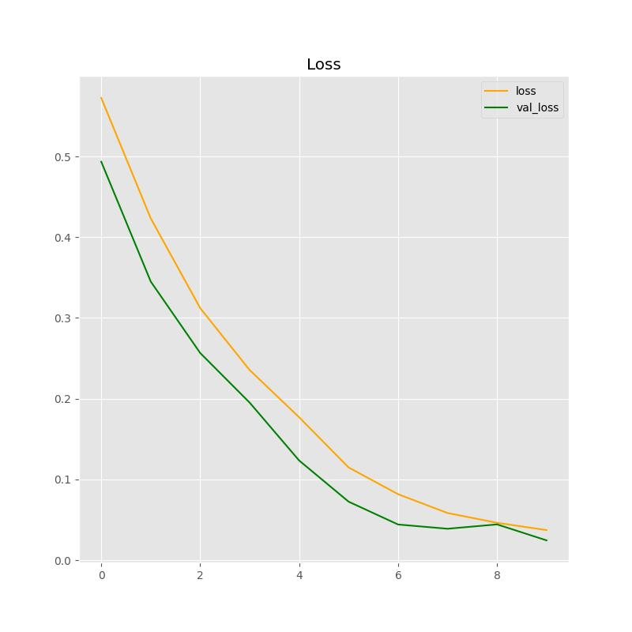
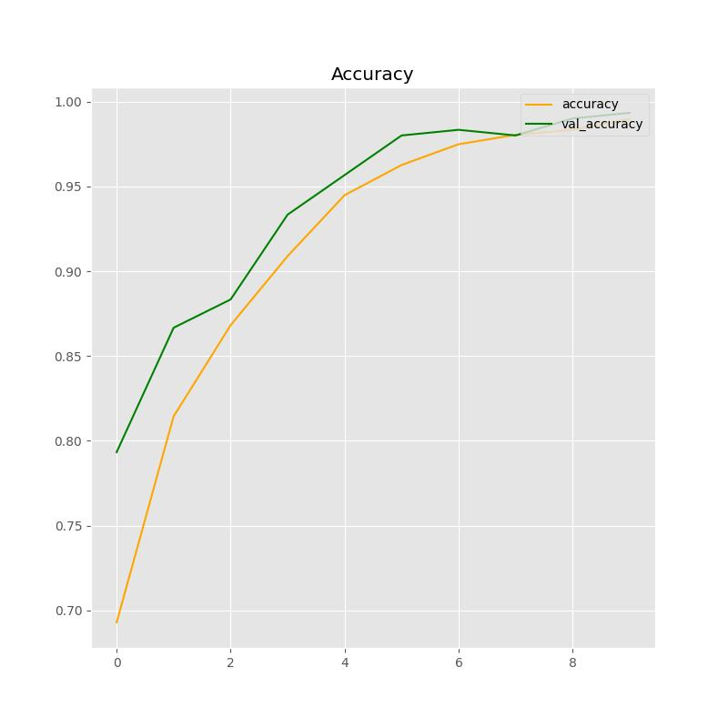

# Brain Tumor Detection

This repository aims to implement a Convolutional Neural Network (CNN) for brain tumor detection. The project includes a Python-based CNN model trained on a dataset of brain MRI scans to classify images as either tumor-present or tumor-absent. Additionally, a user-friendly interface is provided to allow easy interaction with the trained model. This interface enables users to upload MRI scans and visualize predictions. The data  is from https://www.kaggle.com/datasets/ahmedhamada0/brain-tumor-detection. 

The project serves as a practical demonstration of applying deep learning techniques to medical image analysis, specifically for brain tumor detection, with accessibility in mind through a user-friendly interface.





**Goal**
- Implement a CNN for brain tumor detection from MRI images.
- Integrate a simple and intuitive user interface for interaction.

## Installation
1. Install dependencies:
```bash
conda env create -f environment.yml
```

2. In the directory where is the file app.py, run:
```bash
python app.py
```

3. Open the index.html in your browser (located in templates folder).
